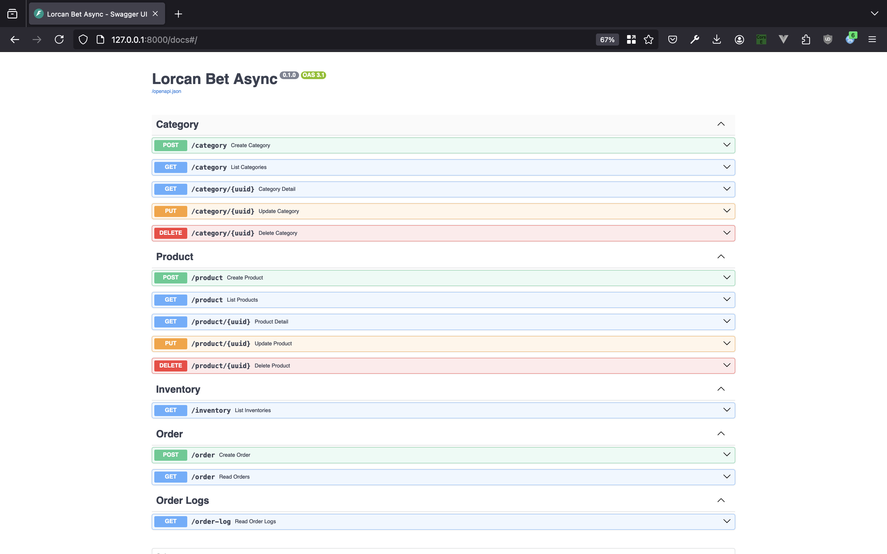

# Lorcan bet async

## Installation 

Download the project, open it in your text editor, and follow the steps below.

#### Create a virtual environment

```bash
python -m venv venv
```

#### Activate the virtual environment on macOS

```bash
source venv/bin/activate
```

#### Activate the virtual environment on Windows

```bash
venv\Scripts\activate
```

#### Install the project dependencies

```bash
pip install -r requirements.txt
```

Next, create a PostgreSQL database and name it ```lorcan```  or use a name of your choice.

Open the ```.env``` file and update the following values:

```bash
POSTGRES_USER="postgres" # Database username (default is 'postgres')
POSTGRES_PASSWORD="password" # Database password
POSTGRES_DB="lorcan" # Name of the database you created
test_database_name="lorcan_test" # Name of the test database
database_private_address="localhost" # Private address (default is 'localhost')
database_public_address="localhost" # Public address (default is 'localhost')
database_port=5432 # Database port (default is 5432)
```

Now, to apply migrations, run the following commands:

```bash
alembic upgrade head
```

```bash
alembic revision --autogenerate -m "setup the project"
```

```bash
alembic upgrade head
```

Congratulations! The project is successfully set up. To run the server, use the following command:

```bash
uvicorn app.main:app --reload
```

now open your browser and type url http://127.0.0.1:8000/docs#/




## Testing

### step 1 
create a category e.g ```food``` using the ```POST/category``` in category endpoints list
fetch the list of categories using the ```GET/category``` to make sure category is saved

### step 2
create a product and add the category uuid, product price, and product initial_quantity (total number of the product) and save.
using the ```POST/product``` in product endpoints list

### step 3
fetch the list products using the ```GET/product``` to make sure product is saved

### step 4
fetch the list categories using the ```GET/category``` to make sure the product is added to category

### step 5
fetch the list inventories using the ```GET/inventory``` to make sure the product and the quantity is added to the inventory

### step 6
now create an order with the product uuid and quantity

Order retry 3 times if something goes wrong before it finally failed

### step 7
fetch the list inventories using the ```GET/inventory``` check the quantity of the product if it changes after an order was successful

### step 8
fetch the list order logs using the ```GET/order-log``` to make sure it logs all the stages of the order while processing the order.
